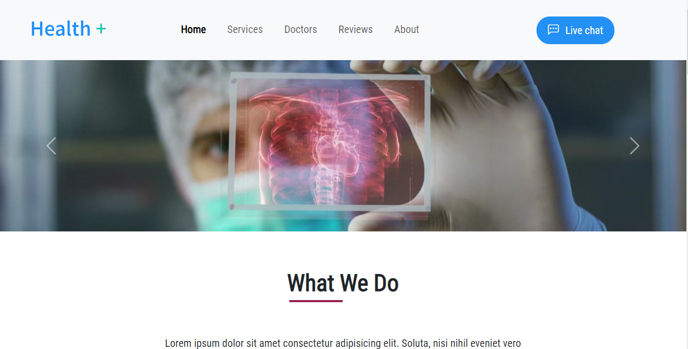

# Landing page de consultas medicas

### Proyecto para practicar html, css y bootstrap.
### Se crearon los archivos index.html, styles.css y main.js (consta solamente de una funcionalidad para subir al top cuando nos desplazamos 200px). Cada uno en su correspondiente carpeta.
### A su vez se agregaron imagenes a la carpeta images.

## Muestra del inicio
